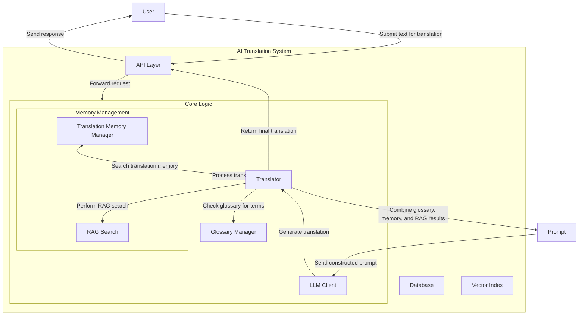

```mermaid
graph TD
    User[User]
    subgraph AI_Translation_System[AI Translation System]
        API[API Layer]
        subgraph Core[Core Logic]
            Translator[Translator]
            GlossaryManager[Glossary Manager]
            LLMClient[LLM Client]
            subgraph Memory[Memory Management]
                TMManager[Translation Memory Manager]
                RAGSearch[RAG Search]
            end
        end
        Database[Database]
        VectorIndex[Vector Index]
    end

    User -->|Submit text for translation| API
    API -->|Forward request| Core
    Core -->|Process translation request| Translator
    Translator -->|Check glossary for terms| GlossaryManager
    Translator -->|Search translation memory| TMManager
    Translator -->|Perform RAG search| RAGSearch
    Translator -->|Combine glossary, memory, and RAG results| Prompt
    Prompt -->|Send constructed prompt| LLMClient
    LLMClient -->|Generate translation| Translator
    Translator -->|Return final translation| API
    API -->|Send response| User
```
