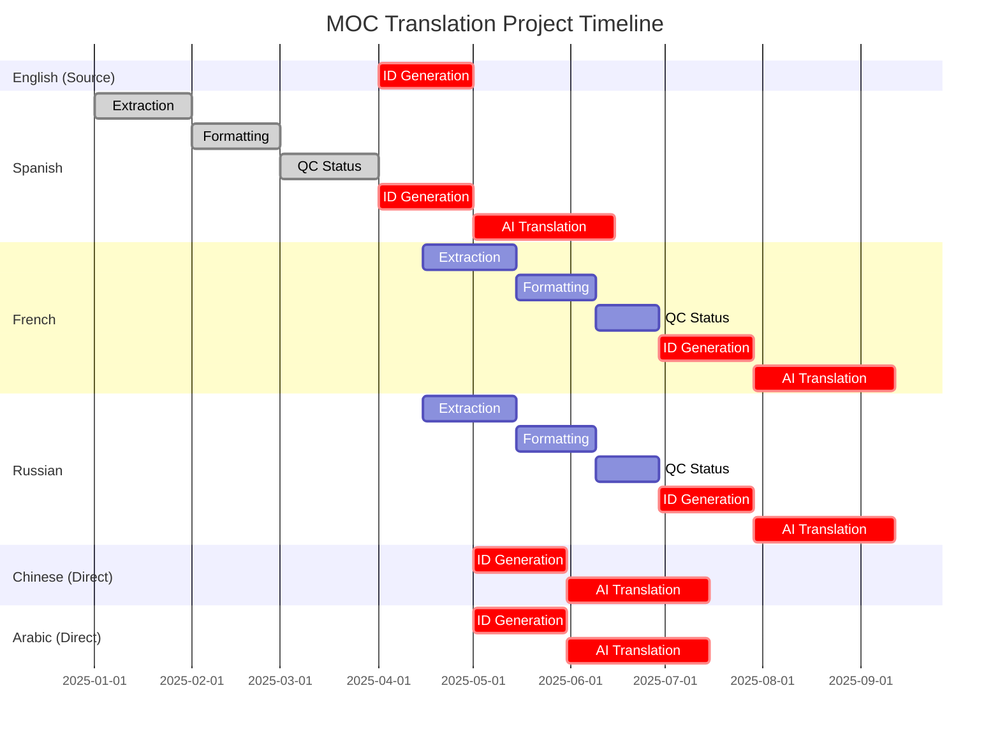
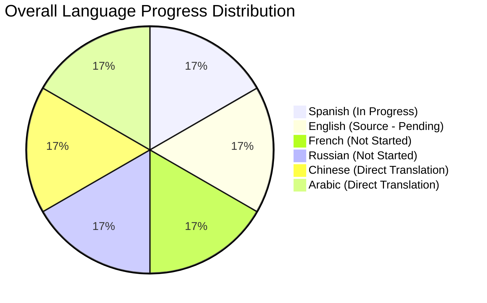
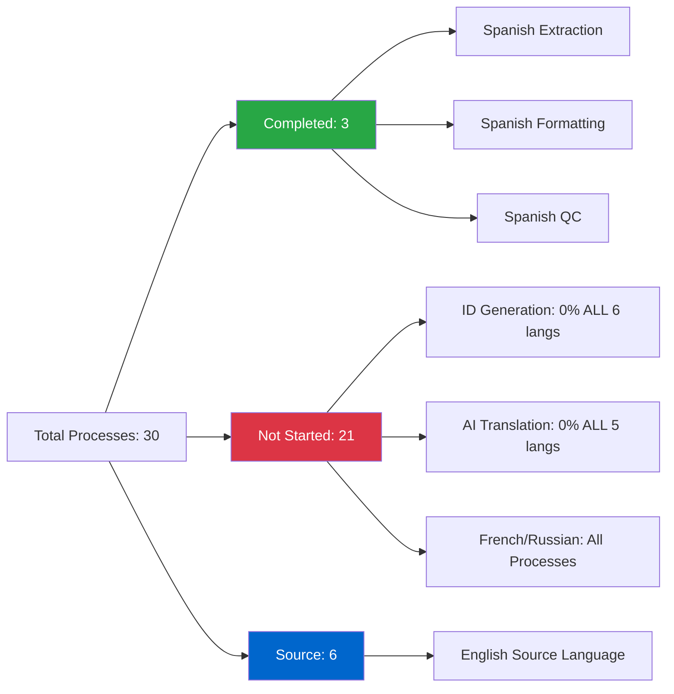
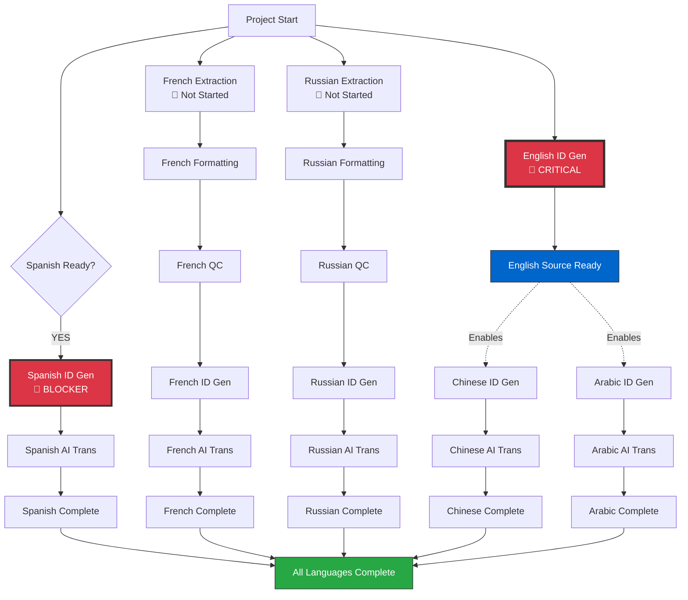
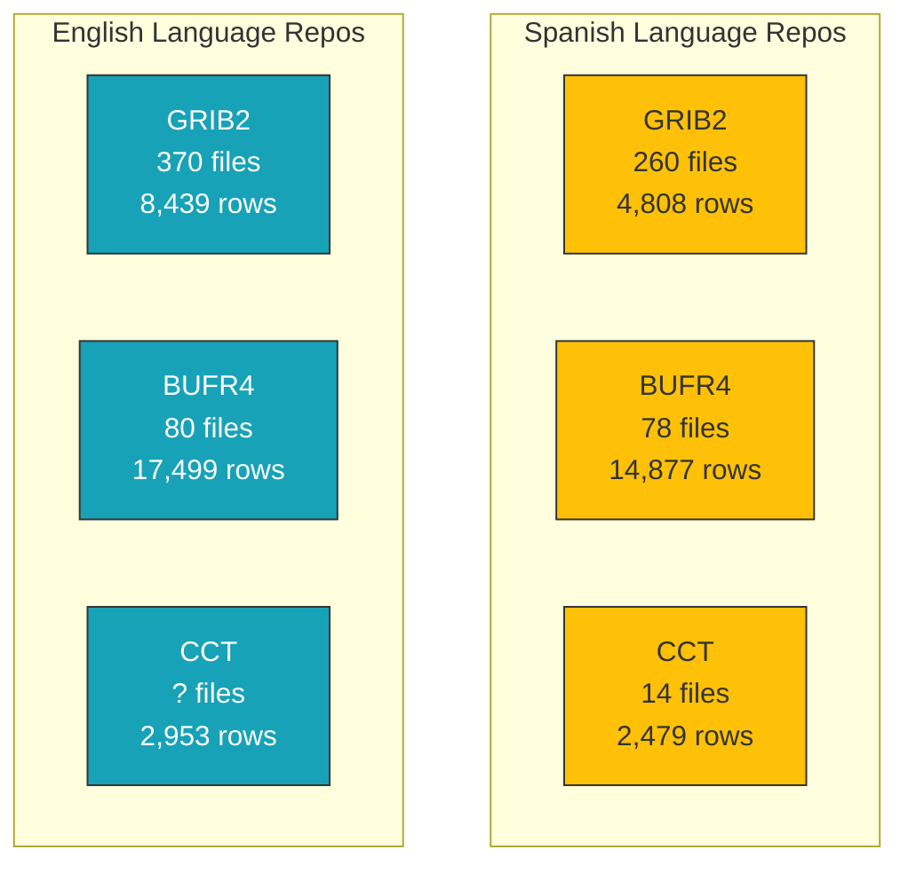

# MOC Translation Project - Mermaid Visualizations

## 📋 Translation Process Flows

- **🇬🇧 English (Source):** ID Generation only
- **🇪🇸 Spanish / 🇫🇷 French / 🇷🇺 Russian:** Extraction → Formatting → QC → ID Generation → AI Translation
- **🇨🇳 Chinese / 🇸🇦 Arabic:** ID Generation → AI Translation (direct from English)

## Process Flow Diagram

```mermaid
graph TB
    subgraph English[English SOURCE - ID Gen Only]
        E1[ID Generation<br/>🔴 0%]
        E1 --> E_END[Source Complete]
        
        style E1 fill:#dc3545,stroke:#333,color:#fff,stroke-width:3px
        style E_END fill:#0066cc,stroke:#333,color:#fff
    end
    
    subgraph Spanish[Spanish - 60% Complete]
        S1[Extraction<br/>✅ 100%]
        S2[Formatting<br/>✅ 100%]
        S3[QC Status<br/>✅ 100%]
        S4[ID Generation<br/>🔴 0%]
        S5[AI Translation<br/>🔴 0%]
        S1 --> S2 --> S3 --> S4 --> S5
        
        style S1 fill:#28a745,stroke:#333,color:#fff
        style S2 fill:#28a745,stroke:#333,color:#fff
        style S3 fill:#28a745,stroke:#333,color:#fff
        style S4 fill:#dc3545,stroke:#333,color:#fff
        style S5 fill:#dc3545,stroke:#333,color:#fff
    end
    
    subgraph French[French - Not Started]
        F1[Extraction<br/>🔴 0%]
        F2[Formatting<br/>🔴 0%]
        F3[QC Status<br/>🔴 0%]
        F4[ID Generation<br/>🔴 0%]
        F5[AI Translation<br/>🔴 0%]
        F1 --> F2 --> F3 --> F4 --> F5
        
        style F1 fill:#dc3545,stroke:#333,color:#fff
        style F2 fill:#dc3545,stroke:#333,color:#fff
        style F3 fill:#dc3545,stroke:#333,color:#fff
        style F4 fill:#dc3545,stroke:#333,color:#fff
        style F5 fill:#dc3545,stroke:#333,color:#fff
    end
    
    subgraph Russian[Russian - Not Started]
        R1[Extraction<br/>🔴 0%]
        R2[Formatting<br/>🔴 0%]
        R3[QC Status<br/>🔴 0%]
        R4[ID Generation<br/>🔴 0%]
        R5[AI Translation<br/>🔴 0%]
        R1 --> R2 --> R3 --> R4 --> R5
        
        style R1 fill:#dc3545,stroke:#333,color:#fff
        style R2 fill:#dc3545,stroke:#333,color:#fff
        style R3 fill:#dc3545,stroke:#333,color:#fff
        style R4 fill:#dc3545,stroke:#333,color:#fff
        style R5 fill:#dc3545,stroke:#333,color:#fff
    end
    
    subgraph Chinese[Chinese DIRECT - From English]
        C1[ID Generation<br/>🔴 0%]
        C2[AI Translation<br/>🔴 0%]
        C1 --> C2
        
        style C1 fill:#dc3545,stroke:#333,color:#fff
        style C2 fill:#dc3545,stroke:#333,color:#fff
    end
    
    subgraph Arabic[Arabic DIRECT - From English]
        A1[ID Generation<br/>🔴 0%]
        A2[AI Translation<br/>🔴 0%]
        A1 --> A2
        
        style A1 fill:#dc3545,stroke:#333,color:#fff
        style A2 fill:#dc3545,stroke:#333,color:#fff
    end
    
    English -.English IDs enable.-> Chinese
    English -.English IDs enable.-> Arabic
```

## Gantt Chart - Project Timeline

## Language Progress Pie Chart

## Process Status Overview

## Critical Path Analysis

## Repository Breakdown

---

**Legend:**
- ✅ Green = Completed (100%)
- 🔴 Red = Not Started (0%)
- ⚫ Gray = Not Applicable (N/A)
- 🟡 Yellow = In Progress

**How to View:**
Copy any of these Mermaid code blocks into:
- GitHub/GitLab markdown files (will render automatically)
- Mermaid Live Editor: https://mermaid.live/
- VS Code with Mermaid Preview extension
- Notion, Confluence, or other tools supporting Mermaid
