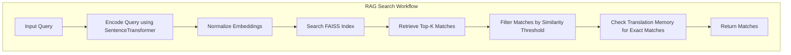

```mermaid
graph TD
    subgraph RAG_Search["RAG Search Workflow"]
        Query["Input Query"]
        Encode["Encode Query using SentenceTransformer"]
        Normalize["Normalize Embeddings"]
        SearchFAISS["Search FAISS Index"]
        RetrieveMatches["Retrieve Top-K Matches"]
        FilterMatches["Filter Matches by Similarity Threshold"]
        TMCheck["Check Translation Memory for Exact Matches"]
        ReturnResults["Return Matches"]
    end

    Query --> Encode --> Normalize --> SearchFAISS --> RetrieveMatches --> FilterMatches --> TMCheck --> ReturnResults
```
