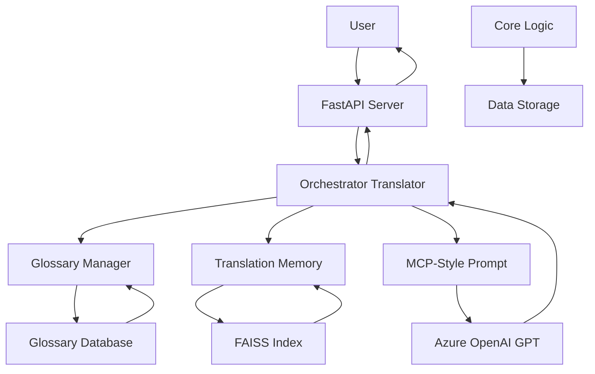

```mermaid
graph TD
    User[User]

    API[FastAPI Server]
    Core[Core Logic]
    LLM[Azure OpenAI GPT]
    Storage[Data Storage]

    Orchestrator[Orchestrator Translator]
    Glossary[Glossary Manager]
    Memory[Translation Memory]
    Prompt[MCP-Style Prompt]

    FAISS[FAISS Index]
    GlossaryDB[Glossary Database]

    User --> API
    API --> Orchestrator
    Orchestrator --> Glossary
    Glossary --> GlossaryDB
    GlossaryDB --> Glossary
    Orchestrator --> Memory
    Memory --> FAISS
    FAISS --> Memory
    Orchestrator --> Prompt
    Prompt --> LLM
    LLM --> Orchestrator
    Orchestrator --> API
    API --> User

    Core --> Storage 
```
