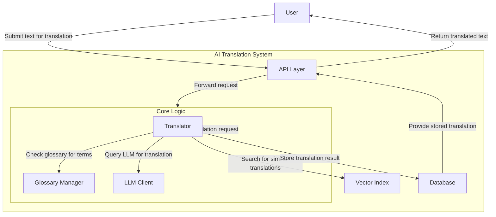

```mermaid
graph TD
    User[User]
    subgraph AI_Translation_System[AI Translation System]
        API[API Layer]
        subgraph Core[Core Logic]
            Translator[Translator]
            GlossaryManager[Glossary Manager]
            LLMClient[LLM Client]
        end
        Database[Database]
        VectorIndex[Vector Index]
    end

    User -->|Submit text for translation| API
    API -->|Forward request| Core
    Core -->|Process translation request| Translator
    Translator -->|Check glossary for terms| GlossaryManager
    Translator -->|Query LLM for translation| LLMClient
    Translator -->|Search for similar translations| VectorIndex
    Translator -->|Store translation result| Database
    Database -->|Provide stored translation| API
    API -->|Return translated text| User
```
