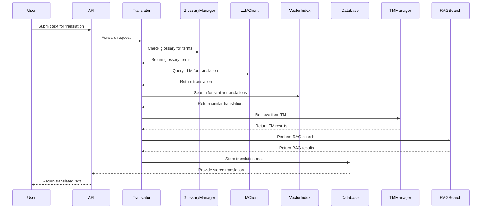

```mermaid
sequenceDiagram
    participant User
    participant API
    participant Translator
    participant GlossaryManager
    participant LLMClient
    participant VectorIndex
    participant Database
    participant TMManager
    participant RAGSearch

    User->>API: Submit text for translation
    API->>Translator: Forward request
    Translator->>GlossaryManager: Check glossary for terms
    GlossaryManager-->>Translator: Return glossary terms
    Translator->>LLMClient: Query LLM for translation
    LLMClient-->>Translator: Return translation
    Translator->>VectorIndex: Search for similar translations
    VectorIndex-->>Translator: Return similar translations
    Translator->>TMManager: Retrieve from TM
    TMManager-->>Translator: Return TM results
    Translator->>RAGSearch: Perform RAG search
    RAGSearch-->>Translator: Return RAG results
    Translator->>Database: Store translation result
    Database-->>API: Provide stored translation
    API-->>User: Return translated text
```
